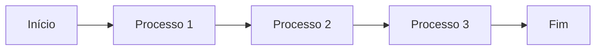

O template foi pensado para pessoas que desejam escrever usando a linguagem de marcação Markdown.

Abaixo estão algumas informações, mas você pode consultar o [Markdown Guide](https://www.markdownguide.org/) para um entendimento mais profundo.

## Títulos

### Sintaxe:

```markdown
# Título 1

## Título 2

### Título 3

#### Título 4

##### Título 5

###### Título 6
```

#### Exibição:

# Título 1

## Título 2

### Título 3

#### Título 4

##### Título 5

###### Título 6

## Estilos de texto

### Sintaxe:

```markdown
**Negrito**
_Itálico_
~~Riscado~~
```

#### Exibição:

**Negrito**

_Itálico_

~~Riscado~~

## Checklist

### Sintaxe:

```markdown
- [ ] Tarefa 1
- [ ] Tarefa 2
- [x] Tarefa 3
```

#### Exibição:

- [ ] Tarefa 1
- [ ] Tarefa 2
- [x] Tarefa 3

## Listas

### Sintaxe:

```markdown
1. Item 1
2. Item 2

- Item
  - Subitem
```

#### Exibição:

1. Item 1
2. Item 2

- Item
  - Subitem

## Links

### Sintaxe:

```markdown
[Texto do Link](https://minhaUrl.com)
```

#### Exibição:

[Texto do Link](https://minhaUrl.com)

## Tabelas

Para adicionar legendas as suas tabelas use a seguinte marcação logo abaixo do texto que servirá de legenda para a tabela:

```bash
{: .caption-table}
```

```markdown
| Header 1 | Header 2 | Header 3 | Header 4 |
| :------: | :------: | :------: | :------: |
|   Col1   |   Col2   |   Col2   |   Col4   |
|   L02    |   L02    |   L02    |   L02    |

Legenda da Tabela
{: .caption-table}
```

#### Exibição

| Header 1 | Header 2 | Header 3 | Header 4 |
| :------: | :------: | :------: | :------: |
|   Col1   |   Col2   |   Col2   |   Col4   |
|   L02    |   L02    |   L02    |   L02    |

Legenda da Tabela
{: .caption-table}

## Block Quote

Para block quotes apenas inicie o texto com `>`.

> Aliquid officiis incidunt eaque, necessitatibus explicabo velit veritatis fugit quaerat, corporis optio voluptates unde ipsum, expedita sunt quae.

## Bubbles

Os Bubbles são uma forma de enfatizar uma informação, há três tipos: _Dica_, _Observação_ e _Aviso_.

```bash
Informações que podem servir para facilitar as coisas.
{: .bubble-tip}

Informações que podem ser úteis e que é importante saber.
{: .bubble-note}

Informação que precisa de atenção para evitar um problema.
{: .bubble-warning}
```

#### Exibição

Informações que podem servir para facilitar as coisas.
{: .bubble-tip}

Informações que podem ser úteis e que é importante saber.
{: .bubble-note}

Informação que precisa de atenção para evitar um problema.
{: .bubble-warning}

## Nota de rodapé

Crie notas de rodapé usando a seguinte sintaxe entre colchetes:

```markdown
<!-- citações -->

Clique no número para localizar a nota de rodapé[^1] e aqui está outra nota de rodapé[^2].

<!-- referências -->

[^1]: Minha primeira referência.
[^2]: Minha segunda referência.
```

#### Exibição

Clique no número para localizar a nota de rodapé[^1] e aqui está outra nota de rodapé[^2].

[^1]: Minha primeira referência.
[^2]: Minha segunda referência.

Independente de onde a nota de rodapé é colocada, a renderização sempre será no final página.
{: .bubble-note}

## Códigos

### Código inline:

Para exibir um código em linha, dentro de um parágrafo, basta envolver o texto com acentos graves (``)

```markdown
O texto com bloco de `código inline` se parece assim.
```

#### Exibição inline:

O texto com bloco de `código inline` se parece assim.

### Bloco de código:

Para escrever um bloco de código envolva o conteúdo com três acentos graves, no início e no fim.

Ao especificar a linguagem de programação no início do bloco após os três acentos graves o código será estilizado.

````markdown
```python
num = int(input('Digite um valor: '))
if num % 2 == 0:
print(f'0 valor {num} é PAR')
```
````

#### Exibição de bloco:

```python
num = int(input('Digite um valor: '))
if num % 2 == 0:
print(f'0 valor {num} é PAR')
```

## Imagem

Para adicionar imagens você possui duas opções.

Imagens sem legendas podem ser adicionadas com a sintaxe básica do Markdown:

```markdown

```

#### Exibição


Para adicionar **legendas** as suas imagens use o include `figure.html` da seguinte forma:



```liquid

```



#### Exibição



## Vídeos do YouTube

Para adicionar vídeos do YouTube use o include `youtube.html` da seguinte forma:



```liquid

```



Substituir o valor do `id` pelo id do vídeo que deseja embutir.

#### Exibição



## Diagramas Mermaid

É possível criar diagrams e fluxogramas de forma fácil e intuitiva usando a sintaxe do mermaid. Você pode visitar o [site oficial](https://mermaid.js.org/intro/syntax-reference.html) para conhecer as diferente formas de cria-los.

````

````

#### Exibição


## Referências
